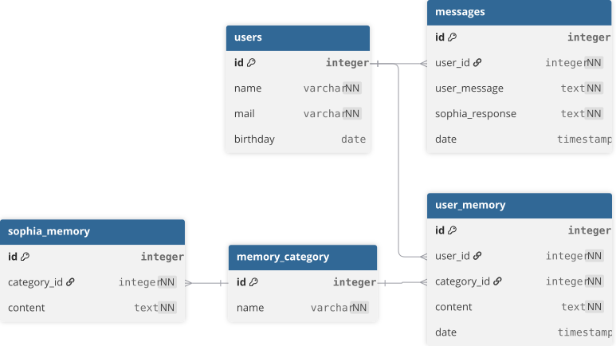
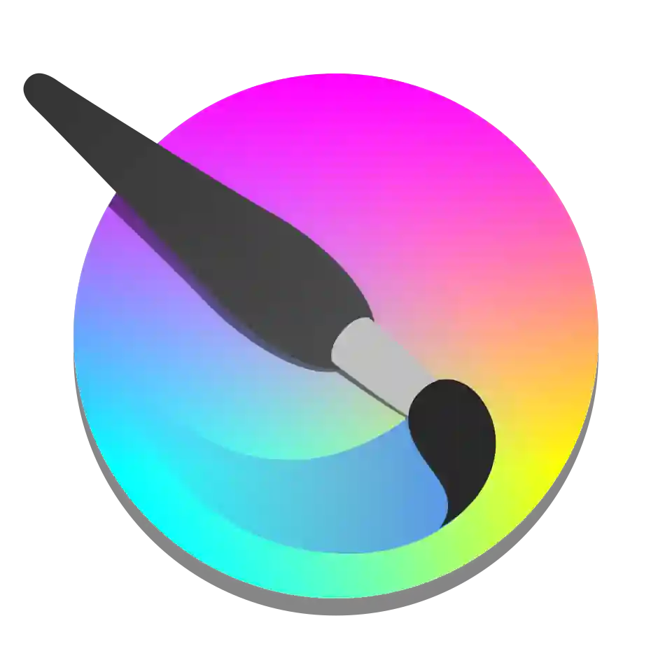

# Arquitectura

## Versión actual: v0.0.2

## Estructura de carpetas

```
 /SOPHIA
    ├── backend/
    │   └── app/
    │       ├── ai/
    │       ├── models/
    │       ├── routers/
    │       └── services/ 
    ├── docs/
    │   └── assets/
    ├── init/
    ├── docker-compose.yml
    └── README.md
```

## Stack actual
- FastAPI + Python
- Ollama + Qwen 3.5
- PostgreSQL
- Docker

## Diagrama de Base de Datos



---

## Stack Objetivo

### Backend
<table align="center">
  <tr>
    <td align="center">
      
      <br/>FastApi
    </td>
    <td align="center">
      
      <br/>Python
    </td>
    <td align="center">
      
      <br/>Ollama
    </td>
  </tr>
  <tr>
    <td align="center">
      
      <br/>Qwen 3.5
    </td>
    <td align="center">
      
      <br/>PostgreSQL
    </td>
    <td align="center">
      
      <br/>Docker
    </td>
  </tr>
</table>

### Frontend
<table align="center">
  <tr>
    <td align="center">
      
      <br/>React
    </td>
    <td align="center">
      
      <br/>Three.js
    </td>
    <td align="center">
      
      <br/>TypeScript
    </td>
  </tr>
</table>

### Tools
<table align="center">
  <tr>
    <td align="center">
      
      <br/>Blender
    </td>
    <td align="center">
      
      <br/>Krita
    </td>
    <td align="center">
      
      <br/>Figma
    </td>
  </tr>
</table>